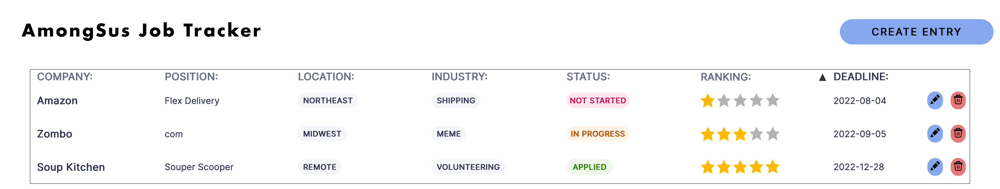

# Team 23 - Project Repository

[](https://github.com/cse110-fa22-group23/cse110-fa22-group23/actions/workflows/pages/pages-build-deployment)
[](https://github.com/cse110-fa22-group23/cse110-fa22-group23/issues)
[](https://codeclimate.com/github/cse110-fa22-group23/cse110-fa22-group23/maintainability)
[](source/lighthouse/lighthouse_report.pdf)
[](source/lighthouse/lighthouse_report.pdf)
[](source/lighthouse/lighthouse_report.pdf)
[](source/lighthouse/lighthouse_report.pdf)
[](https://cse110-fa22-group23.github.io/cse110-fa22-group23/)

## Project Description

[AmoungSus Job Tracker](https://cse110-fa22-group23.github.io/cse110-fa22-group23/) lets you track job applications throughout your job search process. Our site works completely offline using service workers and localstorage and requires no backend server or prod dependencies. We prioritized clean UI/UX, and you can modify and sort your data without ever sharing your data with anyone. Our project is privacy preserving and FOSS - We never track or store any customer interaction.

*Project status: Unmaintained*

## Usage

### View Application

Go to the [Application Page](https://cse110-fa22-group23.github.io/cse110-fa22-group23/).

### For Development

Before contributing, view our [Contribution Guidelines](docs/CONTRIBUTING.md).

**Clone the repository:**

```bash
git clone https://github.com/cse110-fa22-group23/cse110-fa22-group23.git
cd './cse110-fa22-group23'
```

**Go to application source and install packages:**

```bash
cd './source'
npm install
```

**Run scripts:**

```bash
# in './source'
npm run format     # run code formatting
npm run lint       # run code linting
npm run test       # run tests
npm run docs       # run doc generation on js files
# or do `git commit` to run all checks
```

## Documentation

### [Website](https://cse110-fa22-group23.github.io/cse110-fa22-group23/)

### [Docs](https://cse110-fa22-group23.github.io/cse110-fa22-group23/out/)

### [Knowledge Sharing Dump](https://docs.google.com/document/d/1-QBEigVK9CH1N88PAjmWilMuvkyP2tAEQabT399oArc/edit?usp=sharing)

### [Contribution Guidelines](docs/CONTRIBUTING.md)

## Administrative Information

- Team Name: SuuS
  - [Team Introduction](/admin/videos/teamintro.mp4)
  - [Team Information](/admin/team.md)
- Group Contract ([.md](/admin/misc/rules.md), [.pdf](admin/misc/rules.pdf))
- [Meeting Notes](/admin/meetings) ([latest](admin/meetings/111122-sprint-1-review.md))
- [Project Specifications](specs)
