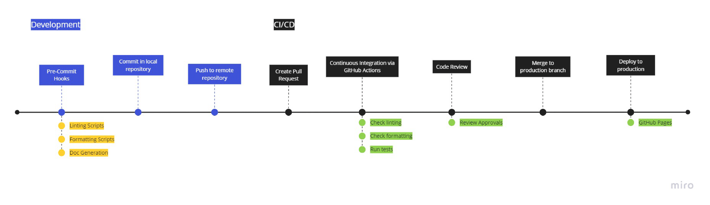

# Continuous Integration and Continuous Development Write-Up

## Summary of CI/CD Pipeline



## Current Tools

### Code Linting

- Checks and flags programmatic and syntactical errors within all source code
- Supports Javascript within project
- Uses [ESLint ver. 8.26.0^](https://eslint.org/) 
- Configuration/relevant files: `source/.eslintrc`, `source/.eslintignore`
- Manually run scripts:
  ```bash
  npm run lint          # fixes problems and writes if possible then checks linting output
  npm run lint:check    # only checks for linting errors
  ```

### Code Formatting

- Checks and rewrites source code, providing code output that conforms to a consistent style
- Supports HTML, CSS, Javascript, JSON, and Markdown within project
- Uses [Prettier ver. 2.7.1^](https://prettier.io/docs/en/index.html)
- Configuration/relevant files: `.prettier`, `source/.prettierignore`
- Manually run scripts:
  ```bash
  npm run format          # fixes formatting and writes
  npm run format:check    # only validates and checks formatting
  ```

### Code Climate (Quality)

- Automated external tool that provides code review and maintainability checks for written code
- Uses [Code Climate - Quality](https://codeclimate.com/quality)

### Doc Generation

- Tool to compile annotated source code into readable documentation for contributors
- Support Javascript within project
- Uses [JSDoc ver. 4.0.0^](https://github.com/jsdoc/jsdoc) 
- Manually run scripts:
  ```bash
  npm run docs     # scans through and generates documentation in source/out
  ```

### Pre-Commit Hooks

- Tool to compile annotated source code into readable documentation for contributors
- Support Javascript within project
- Uses [Husky ver. 8.0.2^](https://typicode.github.io/husky/#/) 

### CI/CD with GitHub Actions

- Automatic CI/CD with [GitHub Actions](https://docs.github.com/en/pages) runs linting, formatting, and unit test checks for developmental branches
- Branch deployment of PRs to our staging site
- Deployment with [GitHub Pages](https://docs.github.com/en/pages)

### [Video Demonstration](phase1.mp4)

## Future Considerations

### Deployment

- Developing and maintaining a more robust backend may require a more suitable deployment platform
- Services fulfilling such needs include Heroku, AWS, Netlify, etc.
