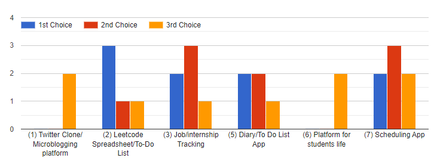

# Meeting Minutes - 10/20/22

## Meeting Information

- Topic(s): Project Brainstorm
- Attendees:
  - Aung, Brian, Xuechen(Daniel), Lily, Jett, Jonathan, Samir, Scott, Nathan
  - (Missing: *Jeffrey*)
- Estimated Time: `120 minutes`
  - Start Time: `1:05 pm`
  - End Time: `3:00 pm`

## Meeting Topics

### Project Idea

- 9 responses
- Low preferences for (1) and (6)
- (2) Leetcode Spreadsheet/To-Do List
  - Pros:
    - Cool integrated product
  - Cons:
    - Lack of innovation
- (3) Job/Internship Tracking
  - Pros:
    - We can have autofill on company name fields/- status
    - Targeted and applicable user base
    - Extendable features
    - Notifications
    - Web scraping
    - Share link with other people
  - Cons:
    - Already invented
    - Negative user experience if we do not get to extendable features
- (5) Diary/To-Do List
  - Pros:
    - Add new features
    - Notifications
    - Priorities
    - Simple to start
  - Cons:
    - Lack of innovation
    - Encompassed more specifically in (2) and (3)
- (7) Scheduling App
  - Pros:
    - Scaleable
  - Cons:
    - Already invented
    - Not enough time
    - Difficult to implement in pure JS

### Preferred Roles (2 each: Frontend, Designer, Backend, DevOps)

- Aung: Frontend, Backend
- Brian: Designer, Backend
- Xuechen (Daniel): Frontend, Backend
- Lily: Designer, Frontend
- Jett: Frontend, DevOps
- Jonathan: Frontend, Backend
- Samir: Backend, Frontend
- Scott: Frontend, Designer
- Nathan: Backend, Designer
- Jeffrey: Backend, DevOps

### Project Brainstorm

[Miro for Diagramming](https://miro.com/welcome/RjNNYVRzNXZFbXdBTFFWa0lrRGs3RGMyTUs5TWVRVDNXSWhQNGkyRjFXWjNrb0pQZVloeWxUMWFheVl2NWVSbXwzNDU4NzY0NTM2NDk3OTQ2NjgzfG4vYQ==?share_link_id=245159924368)

[Project Pitch](https://docs.google.com/presentation/d/1Xa1itO2GpvjrLsEaNZF1tHB3CoE3SUKEiSdJk5a48bk/edit?usp=sharing)

- Starting Pitch
  - Problem, solution, features and their priorities, why the features are chosen **(Jonathan, Aung)**
  - Statement of Purpose **(Daniel, Nathan)**
  - User Personas, User Stories **(Lily, Scott)**
  - Project Roadmap, System Diagrams & Wireframes **(Jeffrey, Jett)**
  - Risks/Rabbit Holes **(Brian, Samir)**

## Closing

### Action Items for All Members

- **By End of Tuesday (10/25)**
  - Complete assigned slide for starting pitch
  - Work on any additional brainstorming as you see fit (ex: detailed user personas)

### Action Items for Team Leads

- None
