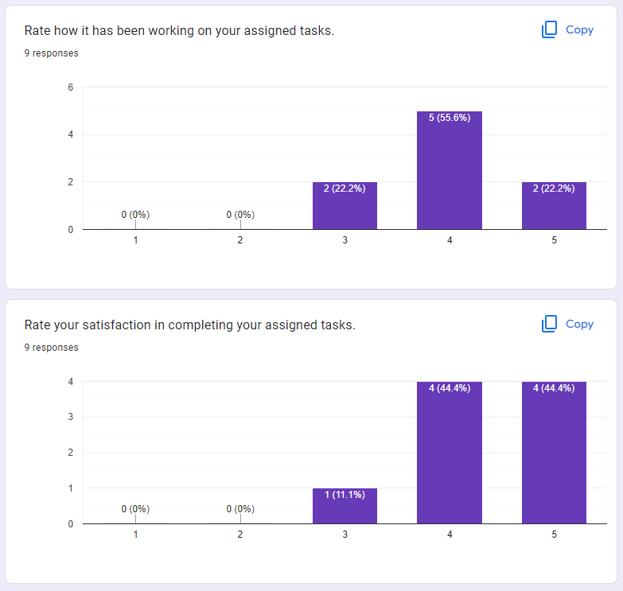

# Meeting Minutes - 11/28/22

## Meeting Information

- Topic(s): Sprint Review + Retrospective 2, Final Planning
- Attendees:
  - Aung, Xuechen(Daniel), Jeffrey, Jett, Samir, Nathan, Brian, Scott, Lily, Jonathan
  - (Missing: *none*)
- Estimated Time: `30 minutes`
  - Start Time: `7:00 pm`
  - End Time: `7:30 pm`

## Meeting Topics

### Sprint Review + Retrospective
- Fill out retrospective: https://forms.gle/bUiKE1aBpfVHfm1q8
- Results:
  - 
  - Summary:
    - Things that are working
      - Communication
      - Assignment in groups
      - Size of assigned tasks
      - Responsiveness
      - Descriptions in issues/pull requests/reviews
    - Things that are not working
      - Sometimes unclear instructions
      - COVID
      - Ensuring all members contribute equally

### Action Items for All Members
- Work on issues #134, #126, #123, #124
